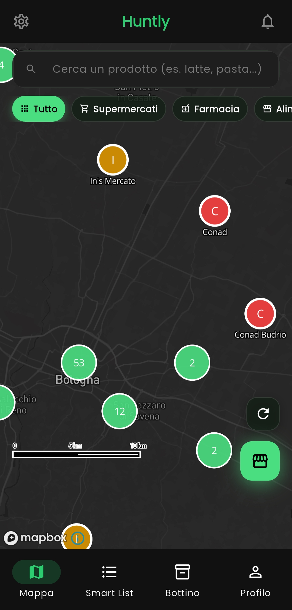
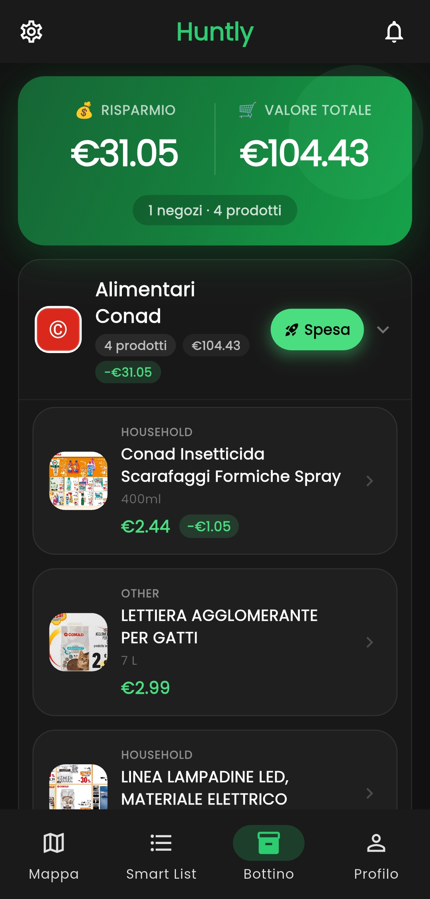
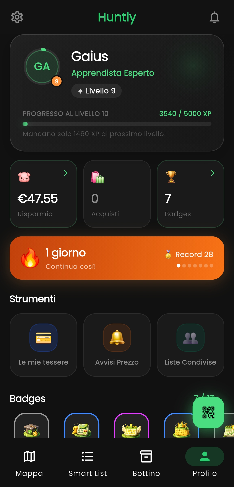
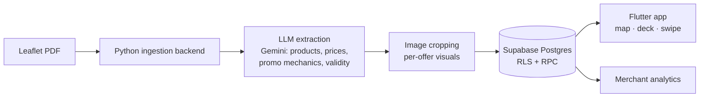

# Huntly 🦌

**Turning local commerce digital — from metropolitan supermarkets to the forgotten businesses of rural Europe.**

> ⚠️ This is a public **showcase** of a private, production codebase built end-to-end by a solo founder. The numbers below are live database counts, not projections.

| | |
|---|---:|
| Mapped stores | **10,491** |
| Structured offers | **623,116** |
| Normalized products | **4,574** |
| Platforms | Android · iOS (Flutter) |

---

## The problem

Supermarket deals still live on **paper leaflets** — unstructured, unsearchable, invisible to anyone holding a smartphone. And beyond groceries, the small shops and restaurants of non-urban areas have **no digital presence at all**: no website, no online menu, no reach. Delivery and booking platforms ignore them or charge fees that small rural volumes can't sustain.

## What Huntly does today

A cross-platform mobile app that makes saving money feel like a treasure hunt:

- 🗺️ **Interactive map** (Mapbox) of 10k+ stores with live offer counts per shop
- 🃏 **Flyer deck + swipeable offer cards** — browse deals like a card game, not a PDF
- 🛒 **Shared shopping lists** in realtime (Supabase realtime) with smart suggestions
- 💰 **Price comparison & savings report** — how much you actually saved
- 🎮 **Gamification**: XP, levels, badges, loot mechanics
- 📣 **B2B side**: self-service advertiser portal with campaign review workflow
- 🌍 Localized app + multilingual website (IT/EN/FR/DE/ES/NL)

### Screenshots

| Map (live store clusters) | Saved deals — leaflet-cropped visuals | Gamification |
|---|---|---|
|  |  |  |

*The product images in the middle screenshot are automatic crops from the original paper leaflet — output of the ingestion pipeline described below.*

## How the data gets in: the ingestion pipeline

The hard part isn't the app — it's turning a paper leaflet PDF into 600k structured, priced, geolocated offers **at near-zero marginal cost**.

- **Today**: LLM-driven extraction (Gemini) parses each page into structured offers — name, brand, prices, discount mechanics (3x2, loyalty-card-only, bundles), validity windows — plus per-offer image crops served via CDN.
- **Next (designed)**: an **OCR-grounded hybrid** — Google Cloud Vision handles pixel-perfect text geometry, the LLM handles pure semantics over OCR block IDs (never coordinates), and Python merges bounding boxes mathematically. LLMs are great at meaning and terrible at pixels; this architecture lets each component do only what it's good at.

**Stack**: Flutter (Riverpod, go_router) · Supabase (Postgres, RLS, RPC, realtime) · Python ingestion backend (Docker) · Mapbox · Firebase (FCM, Analytics, Crashlytics) · Sentry · Hive (offline-first cache) · Astro (web)

## Where it's going: local commerce, everywhere

Huntly is evolving from a grocery-deals aggregator into the **digital infrastructure for local commerce** — cities included (Bologna's supermarkets are already live on the platform). The expansion starts from rural areas because that's where the need is sharpest and the competition absent, beginning with the Bolognese Apennines — where I live:

1. **Free, concierge-quality digital storefronts** for small businesses: we visit each merchant, shoot the content, build the page. Zero tech barrier, zero cost for them.
2. **Menus as browsable cards** — a restaurant's menu becomes swipeable cards (dish, price, ingredients, allergens), reusing the exact UX users already know from leaflets.
3. **Merchant analytics** as the value proof, then premium visibility and professional content services as revenue.

The model is replicable across every rural region in Europe — hundreds of thousands of businesses no platform is fighting for.

## About

Built entirely by **Josias Gaius Tsaamo Momo** — solo technical founder based in San Benedetto Val di Sambro, a mountain village in the Italian Apennines.

Also on my GitHub: [blender-claude-mcp](https://github.com/Gaius114/blender-claude-mcp) and [unity-claude-mcp](https://github.com/Gaius114/unity-claude-mcp) — HTTP bridges that let an AI agent drive Blender and Unity with a feedback loop.

📫 Contact: tmjgaius@gmail.com · [gethuntly.eu](https://www.gethuntly.eu)

---
© 2026 — All rights reserved. The Huntly codebase is proprietary; this repository exists for demonstration purposes.
